# ⚡ EnergyPulse — India Electricity Analysis

An interactive dashboard analyzing electricity consumption trends across Indian states and regions, with a focus on comparing pre- and post-COVID lockdown data (2019 vs 2020).

🔗 **Live Demo:** [india-electricity-analysis.vercel.app](https://india-electricity-analysis.vercel.app/)

---

## 📸 Screenshots

### Dashboard — National Trends
| | |
|---|---|
| 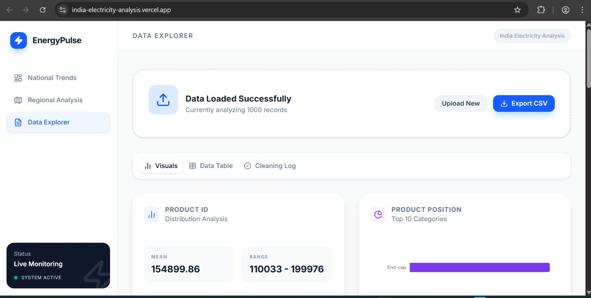 | 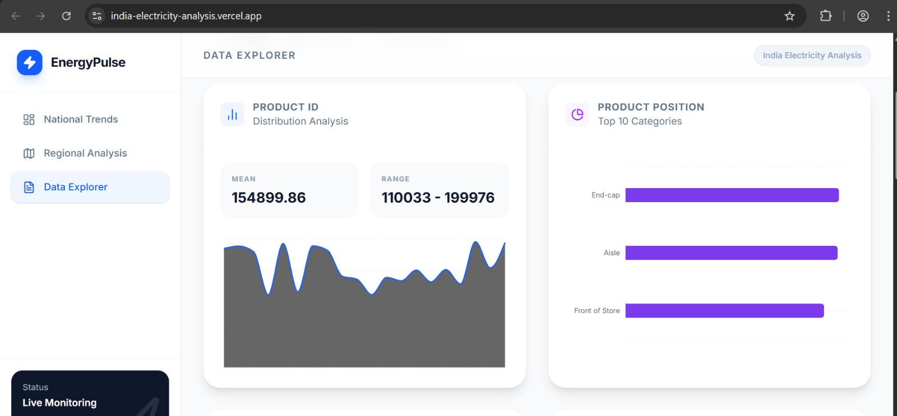 |

### Regional Analysis
| | |
|---|---|
| 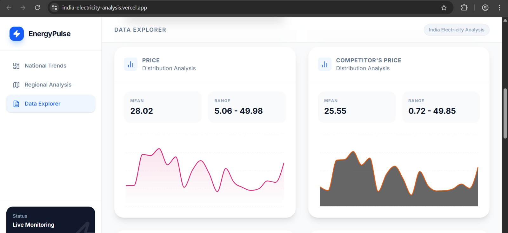 | 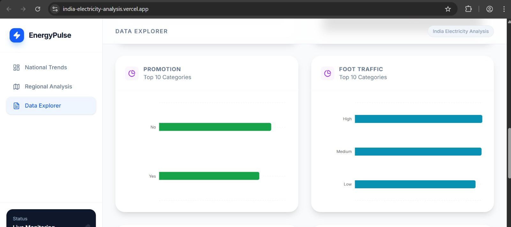 |
| 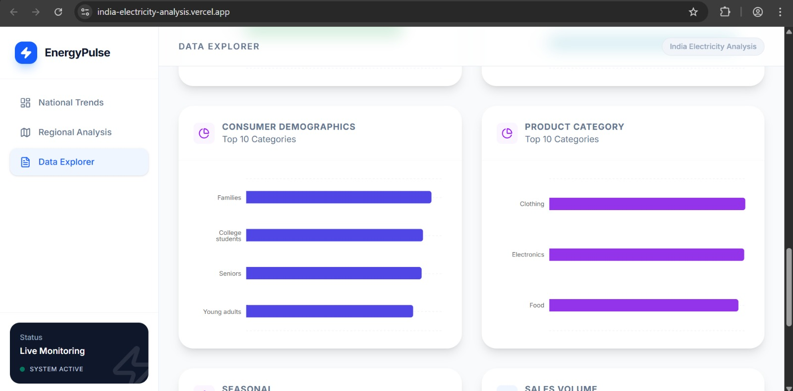 | 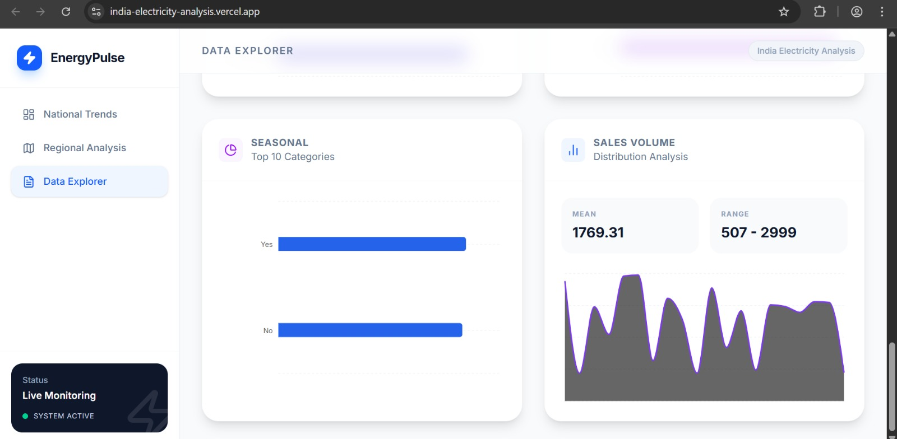 |

### Data Explorer — CSV Analyzer
| | |
|---|---|
| 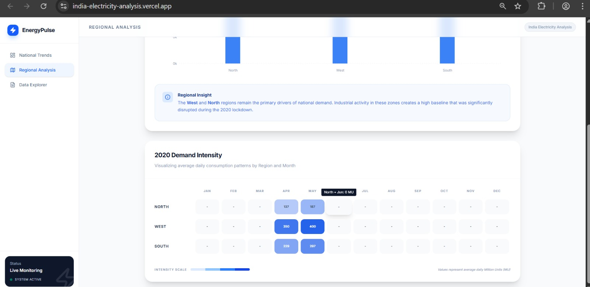 | 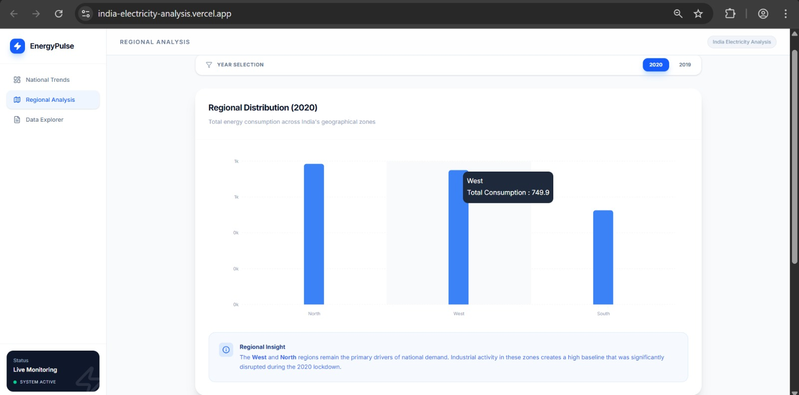 |
| 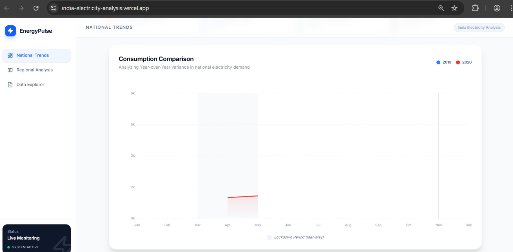 | 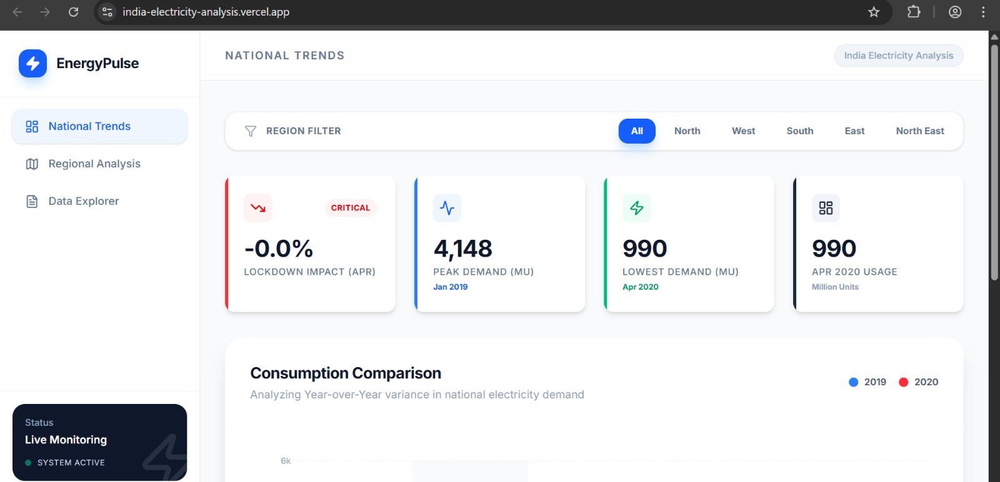 |

### App Overview
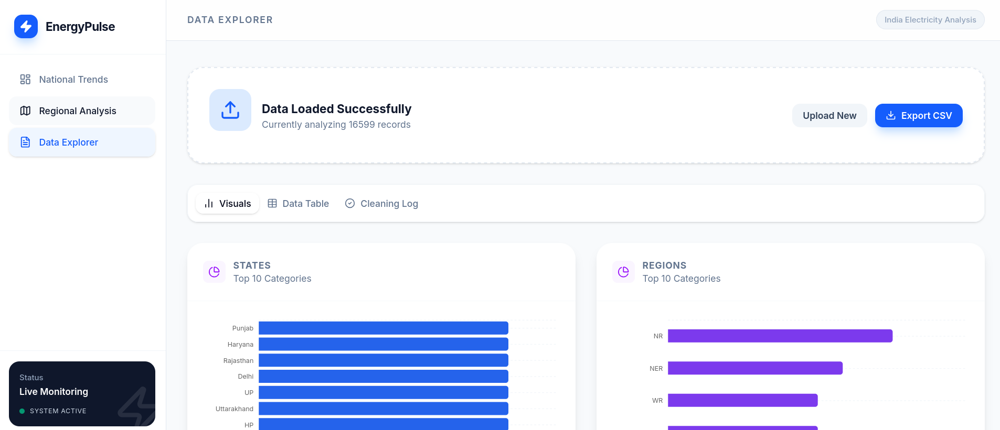

---

## 📊 Data Visualizations (Tableau-Style)

### State-wise Electricity Consumption
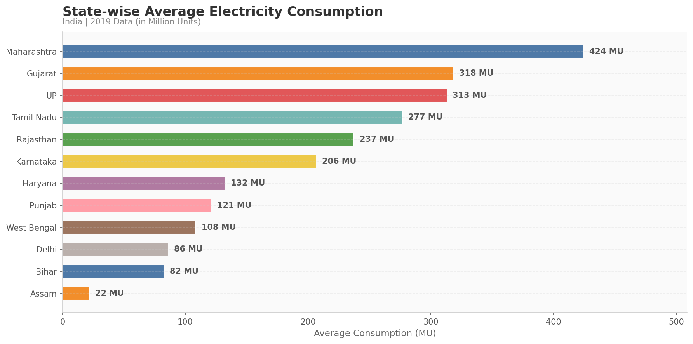

### Regional Electricity Distribution
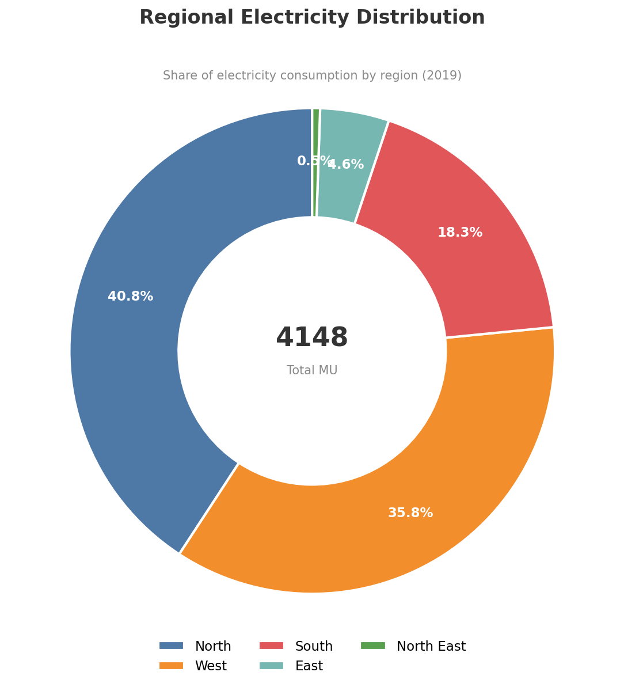

### COVID-19 Lockdown Impact on Demand
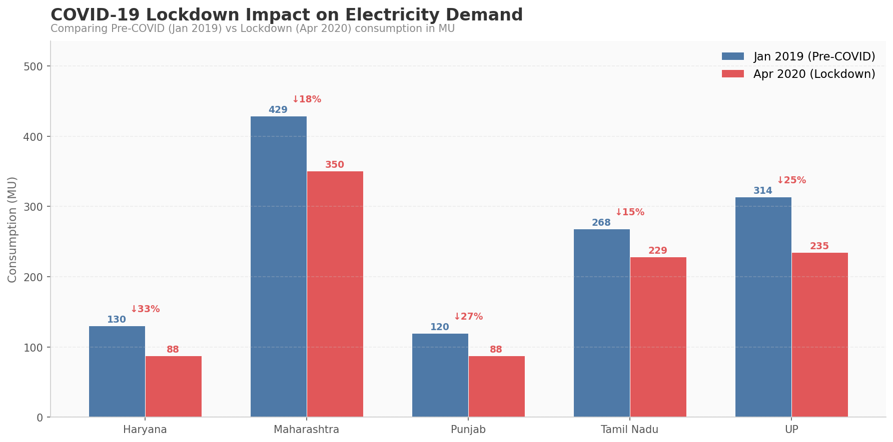

### Consumption Heatmap — State × Date
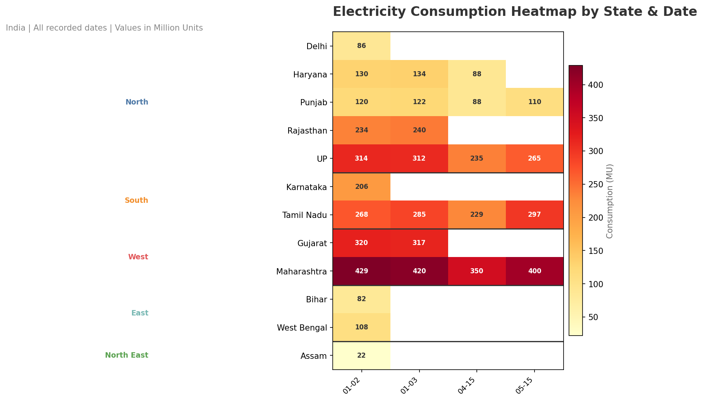

### Electricity Demand Trend — Key States
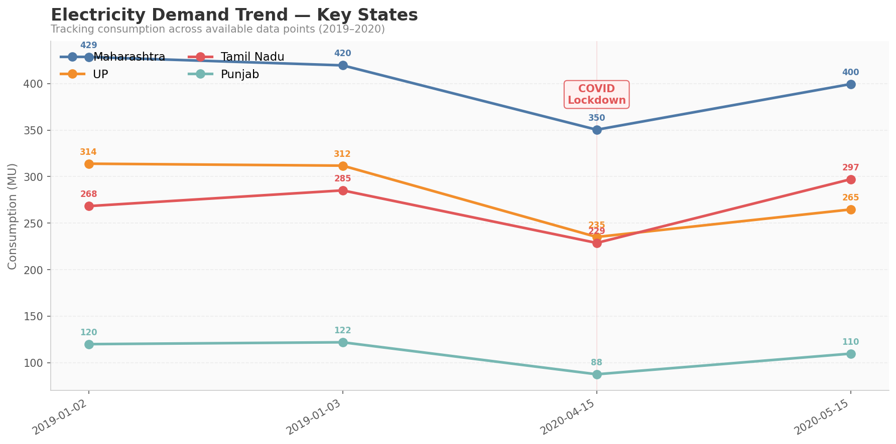

---

## ✨ Features

- **National Trends** — Year-over-year comparison of electricity consumption (2019 vs 2020) with COVID-19 lockdown impact analysis
- **Regional Analysis** — Regional distribution bar charts, market share pie charts, and consumption heatmaps across 5 Indian regions
- **Data Explorer** — Upload custom CSV files with drag-and-drop, auto-cleaning, type detection, and visualization generation
- **KPI Dashboard** — Key metrics including lockdown impact %, peak demand, lowest demand, and April 2020 comparison
- **Responsive Design** — Desktop sidebar + mobile-optimized tabbed navigation

## 🛠️ Tech Stack

| Technology | Purpose |
|---|---|
| React 19 + TypeScript | Frontend framework |
| Vite | Build tool |
| Tailwind CSS 4 | Styling |
| Recharts | Data visualization |
| PapaParse | CSV parsing |
| Lucide React | Icons |
| date-fns | Date utilities |

## 🚀 Run Locally

**Prerequisites:** Node.js

1. Install dependencies:
   ```bash
   npm install
   ```
2. Run the app:
   ```bash
   npm run dev
   ```
3. Open [http://localhost:3000](http://localhost:3000) in your browser.

## 📂 Project Structure

```
src/
├── App.tsx                  # Main app layout with sidebar navigation
├── components/
│   ├── Scenario1.tsx        # National Trends — YoY comparison charts
│   ├── Scenario2.tsx        # Regional Analysis — distribution & heatmaps
│   ├── CsvAnalyzer.tsx      # Data Explorer — CSV upload & analysis
│   └── ui/                  # Reusable UI components (Card, Tabs)
├── context/
│   └── DataContext.tsx       # State management for custom data uploads
├── data/
│   └── mockData.ts          # Sample electricity data (12 states, 2019-2020)
└── lib/
    ├── csvUtils.ts           # CSV processing utilities
    └── utils.ts              # General utility functions
```

## 👥 Contributors

- [shivam-attri-85](https://github.com/shivam-attri-85) — Shivam Chaudhary
- [GitSKY9795](https://github.com/GitSKY9795) — Sumeet Kumar Yadav
